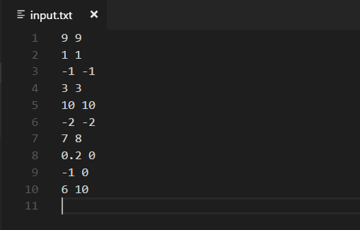
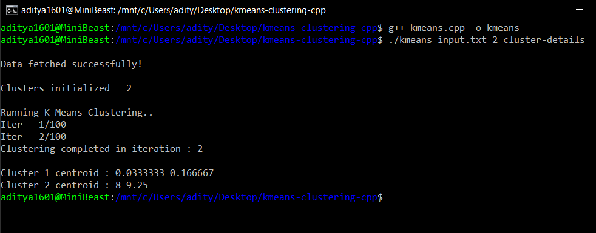
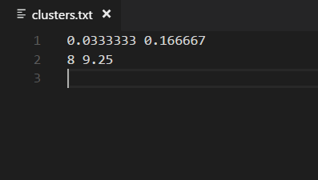

# K-Means clustering in C++

#### This is a C++ implementation of the simple K-Means clustering algorithm.

K-means clustering is a type of unsupervised learning, which is used when you have unlabeled data (i.e., data without defined categories or groups). The goal of this algorithm is to find groups in the data, with the number of groups represented by the variable K. The algorithm works iteratively to assign each data point to one of K groups based on the features that are provided. Data points are clustered based on feature similarity.

## Instructions:
The input supports any number of points and any number of dimensions. Make the "input.txt" file accordingly.

* Download the binary file "kmeans" from the repository.
* Make a file "input.txt" with all the point coordinates. The format should be as shown below (the example has 2-dimensional coordinates):

* Run the kmeans binary with the input file name and number of clusters as command line arguments, as shown below:

* The output will be the center point of each cluster, saved in "clusters.txt" file as shown below:

-------------------------------
